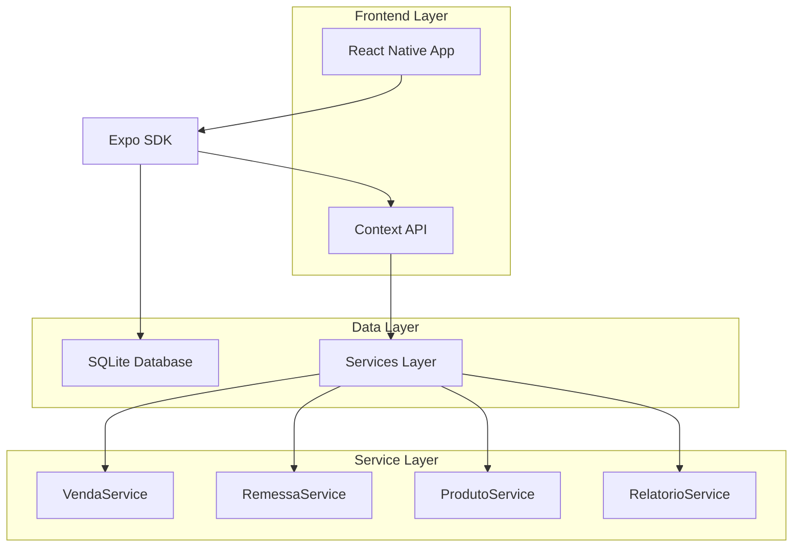
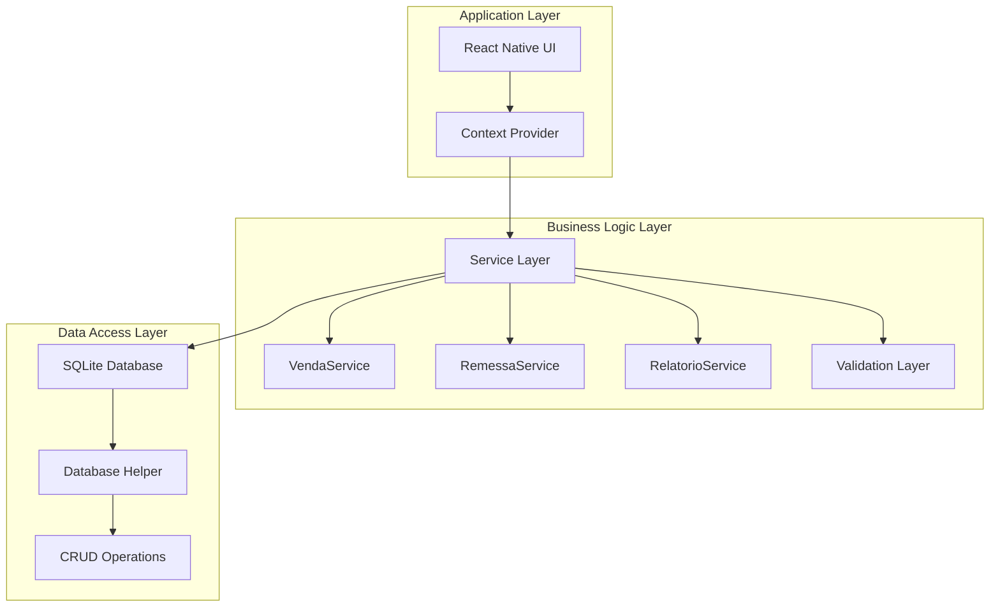
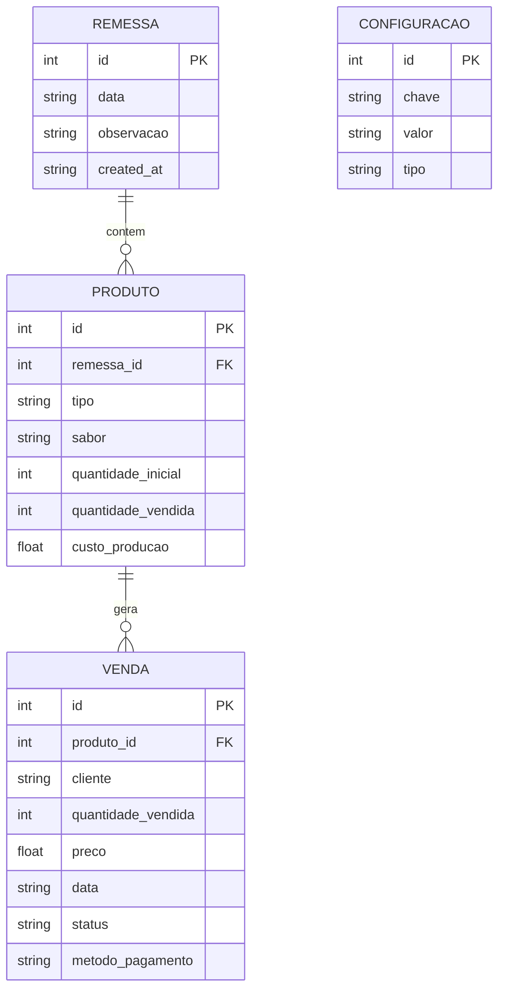
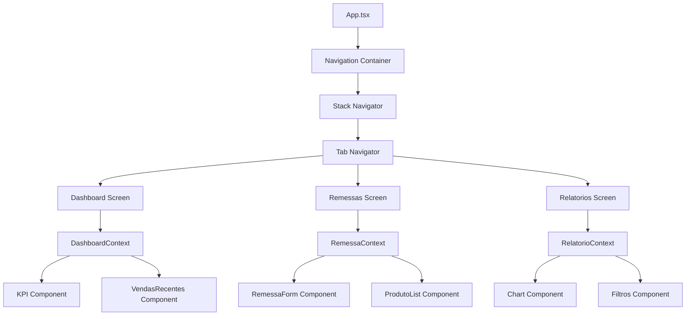

## 1. Architecture design



## 2. Technology Description

- **Frontend**: React Native + Expo SDK 50 + TypeScript
- **Initialization Tool**: expo-cli
- **Database**: SQLite (expo-sqlite)
- **State Management**: React Context API + useReducer
- **Navigation**: Expo Router v3
- **UI Components**: React Native Paper (Material Design)
- **Date Handling**: date-fns
- **Charts**: react-native-chart-kit
- **Storage**: AsyncStorage para configurações

## 3. Route definitions

| Route | Purpose |
|-------|---------|
| / | Dashboard principal com KPIs e vendas recentes |
| /remessas | Lista de remessas e gerenciamento de estoque |
| /remessas/nova | Criação de nova remessa com produtos |
| /remessas/[id] | Detalhes da remessa selecionada |
| /vendas/nova | Formulário rápido para registrar nova venda |
| /relatorios | Análise financeira e relatórios por período |
| /configuracoes | Configurações do aplicativo e metas |

## 4. API definitions

### 4.1 Database Service Layer

**VendaService - Gerenciamento de Vendas**
```typescript
interface VendaCreateParams {
  produto_id: number;
  cliente: string;
  quantidade_vendida: number;
  preco: number;
  data: string;
  status: 'OK' | 'PENDENTE';
}

interface VendaResponse extends VendaCreateParams {
  id: number;
}

// Criar nova venda
POST /vendas
Params: VendaCreateParams
Response: VendaResponse

// Listar vendas por período
GET /vendas?inicio={date}&fim={date}
Response: VendaResponse[]

// Atualizar status de pagamento
PUT /vendas/{id}/status
Params: { status: 'OK' | 'PENDENTE' }
Response: VendaResponse
```

**RemessaService - Gerenciamento de Remessas**
```typescript
interface RemessaCreateParams {
  data: string;
  observacao?: string;
  produtos: Array<{
    tipo: string;
    sabor: string;
    quantidade_inicial: number;
  }>;
}

interface RemessaResponse {
  id: number;
  data: string;
  observacao?: string;
  produtos: ProdutoResponse[];
}

// Criar nova remessa
POST /remessas
Params: RemessaCreateParams
Response: RemessaResponse

// Listar remessas ativas
GET /remessas/ativas
Response: RemessaResponse[]

// Obter detalhes da remessa
GET /remessas/{id}
Response: RemessaResponse
```

**RelatorioService - Análise Financeira**
```typescript
interface RelatorioParams {
  periodo: 'dia' | 'semana' | 'mes';
  data_inicio?: string;
  data_fim?: string;
}

interface RelatorioResponse {
  total_vendido: number;
  total_pendente: number;
  total_lucro: number;
  quantidade_vendida: number;
  produtos_mais_vendidos: Array<{
    produto: string;
    quantidade: number;
    valor_total: number;
  }>;
}

// Gerar relatório financeiro
GET /relatorios?periodo={periodo}
Params: RelatorioParams
Response: RelatorioResponse
```

## 5. Server architecture diagram



## 6. Data model

### 6.1 Data model definition



### 6.2 Data Definition Language

**Tabela de Remessas (remessas)**
```sql
CREATE TABLE remessas (
    id INTEGER PRIMARY KEY AUTOINCREMENT,
    data TEXT NOT NULL,
    observacao TEXT,
    created_at TEXT DEFAULT CURRENT_TIMESTAMP
);

CREATE INDEX idx_remessas_data ON remessas(data);
```

**Tabela de Produtos (produtos)**
```sql
CREATE TABLE produtos (
    id INTEGER PRIMARY KEY AUTOINCREMENT,
    remessa_id INTEGER NOT NULL,
    tipo TEXT NOT NULL,
    sabor TEXT NOT NULL,
    quantidade_inicial INTEGER NOT NULL,
    quantidade_vendida INTEGER DEFAULT 0,
    custo_producao REAL DEFAULT 0,
    created_at TEXT DEFAULT CURRENT_TIMESTAMP,
    FOREIGN KEY (remessa_id) REFERENCES remessas(id)
);

CREATE INDEX idx_produtos_remessa ON produtos(remessa_id);
CREATE INDEX idx_produtos_tipo ON produtos(tipo);
```

**Tabela de Vendas (vendas)**
```sql
CREATE TABLE vendas (
    id INTEGER PRIMARY KEY AUTOINCREMENT,
    produto_id INTEGER NOT NULL,
    cliente TEXT,
    quantidade_vendida INTEGER NOT NULL,
    preco REAL NOT NULL,
    data TEXT NOT NULL,
    status TEXT NOT NULL CHECK (status IN ('OK', 'PENDENTE')),
    metodo_pagamento TEXT,
    created_at TEXT DEFAULT CURRENT_TIMESTAMP,
    FOREIGN KEY (produto_id) REFERENCES produtos(id)
);

CREATE INDEX idx_vendas_data ON vendas(data);
CREATE INDEX idx_vendas_status ON vendas(status);
CREATE INDEX idx_vendas_produto ON vendas(produto_id);
```

**Tabela de Configurações (configuracoes)**
```sql
CREATE TABLE configuracoes (
    id INTEGER PRIMARY KEY AUTOINCREMENT,
    chave TEXT UNIQUE NOT NULL,
    valor TEXT NOT NULL,
    tipo TEXT NOT NULL DEFAULT 'string',
    created_at TEXT DEFAULT CURRENT_TIMESTAMP
);

-- Inserir configurações padrão
INSERT INTO configuracoes (chave, valor, tipo) VALUES 
('meta_diaria_valor', '200.00', 'float'),
('meta_diaria_quantidade', '50', 'integer'),
('custo_padrao_trufa', '2.50', 'float'),
('custo_padrao_sobremesa', '5.00', 'float');
```

## 7. Component Architecture



## 8. State Management Pattern

```typescript
// AppContext principal
interface AppState {
  remessaAtiva: Remessa | null;
  vendas: Venda[];
  configuracoes: Record<string, any>;
}

// Actions disponíveis
type AppAction = 
  | { type: 'SET_REMESSA_ATIVA'; payload: Remessa }
  | { type: 'ADD_VENDA'; payload: Venda }
  | { type: 'UPDATE_CONFIG'; payload: { chave: string; valor: any } }
  | { type: 'LOAD_DATA'; payload: Partial<AppState> };
```

## 9. Performance Considerations

- **Lazy Loading**: Telas carregadas sob demanda via React.lazy
- **Memoização**: Componentes pesados memoizados com React.memo
- **Virtualização**: Listas longas implementadas com FlatList
- **Cache Local**: Dados frequentes armazenados em AsyncStorage
- **Otimização de Queries**: Índices apropriados no SQLite
- **Imagem Otimizada**: Assets otimizados para diferentes densidades