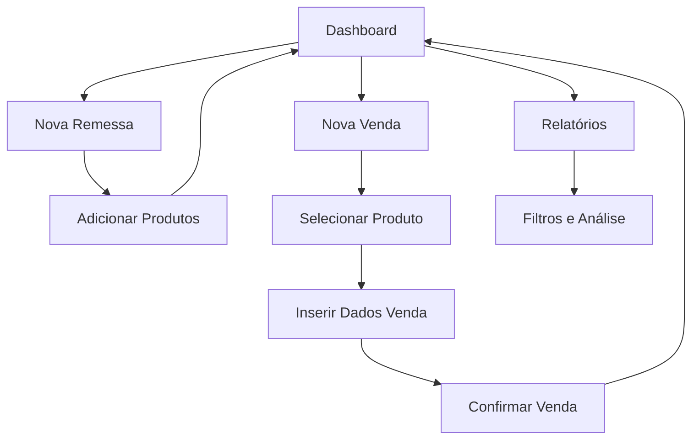

## 1. Product Overview
Aplicativo mobile para gerenciamento de vendas de trufas e sobremesas em ambiente de rua, substituindo o método manual de anotação por um sistema digital eficiente. O app permite controle de estoque/remessas, registro rápido de vendas, acompanhamento financeiro básico e gestão de status de pagamento, otimizando o processo de vendas para pequenos empreendedores.

O produto visa simplificar a vida do vendedor ambulante, fornecendo insights financeiros em tempo real e eliminando erros de cálculo manual.

## 2. Core Features

### 2.1 User Roles
O aplicativo possui um único tipo de usuário - o Vendedor - que acessa todas as funcionalidades sem necessidade de registro complexo. O acesso é local ao dispositivo.

### 2.2 Feature Module
Nosso sistema de gerenciamento de vendas consiste nas seguintes telas principais:

1. **Dashboard**: Visão geral com KPIs financeiros, metas diárias e lista de vendas recentes
2. **Remessas**: Gerenciamento de estoque com criação de novas remessas e visualização de produtos disponíveis
3. **Nova Venda**: Formulário rápido para registrar vendas com controle de pagamento
4. **Relatórios**: Análise detalhada de vendas, lucros e dívidas pendentes

### 2.3 Page Details
| Page Name | Module Name | Feature description |
|-----------|-------------|---------------------|
| Dashboard | KPIs Financeiros | Exibir total vendido no dia, quantia em dívida (pendente), lucro calculado e progresso de meta diária |
| Dashboard | Lista de Vendas | Mostrar últimas 10 vendas com cliente, produto, valor e status de pagamento |
| Dashboard | Navegação Rápida | Botões de acesso rápido para nova venda e nova remessa |
| Remessas | Lista de Remessas | Visualizar remessas ativas e histórico com data e observações |
| Remessas | Nova Remessa | Criar remessa com data atual, adicionar produtos com quantidade inicial |
| Remessas | Detalhes da Remessa | Visualizar produtos, quantidades disponíveis (inicial - vendida) e total vendido |
| Nova Venda | Formulário de Venda | Selecionar produto da remessa ativa, inserir cliente, valor, método de pagamento |
| Nova Venda | Status de Pagamento | Alternância rápida entre OK (pago) e PENDENTE com indicador visual |
| Nova Venda | Confirmação | Botão de confirmação com feedback visual de sucesso |
| Relatórios | Filtros de Período | Selecionar dia, semana ou mês para análise |
| Relatórios | Análise Financeira | Detalhar vendas totais, lucro, custos e dívidas por período |
| Relatórios | Produtos Mais Vendidos | Ranking de produtos com quantidade e valor total vendido |

## 3. Core Process
O fluxo principal do aplicativo segue a jornada do vendedor: criação de remessa → registro de vendas → acompanhamento financeiro.

**Fluxo do Vendedor:**
1. Inicia o dia criando uma nova remessa com os produtos que levará para venda
2. Durante as vendas, registra cada transação rapidamente na tela de nova venda
3. Acompanha o desempenho do dia através do dashboard com KPIs em tempo real
4. No final do dia, verifica relatórios detalhados e gerencia dívidas pendentes

## 4. User Interface Design

### 4.1 Design Style
- **Cores Primárias**: Verde (#4CAF50) para indicadores positivos, Vermelho (#F44336) para pendências
- **Cores Secundárias**: Azul (#2196F3) para ações principais, Cinza (#757575) para textos secundários
- **Botões**: Estilo arredondado com sombra suave, tamanhos adaptáveis para touch mobile
- **Fontes**: Roboto para títulos (18-24px), Open Sans para corpo (14-16px)
- **Layout**: Cards com bordas arredondadas, ícones Material Design para consistência
- **Animações**: Transições suaves entre telas, feedback visual em botões com haptic feedback

### 4.2 Page Design Overview
| Page Name | Module Name | UI Elements |
|-----------|-------------|-------------|
| Dashboard | KPI Cards | Cards com gradiente suave, ícones grandes, números em negrito, cores adaptativas ao valor |
| Dashboard | Lista Vendas | Items com avatar genérico do cliente, badge de status colorido, swipe para ações |
| Remessas | Cards de Produtos | Cards horizontais com imagem placeholder, progress bar de estoque, badge de disponibilidade |
| Nova Venda | Formulário | Campos com labels flutuantes, select com search integrado, teclado numérico para valores |
| Nova Venda | Status Toggle | Switch grande e colorido, com texto claro OK/PENDENTE, animação de transição |

### 4.3 Responsiveness
Aplicativo mobile-first otimizado para smartphones Android e iOS. Interface adaptável a diferentes tamanhos de tela com componentes flexíveis. Suporte a orientação portrait principalmente, com landscape para gráficos e relatórios.